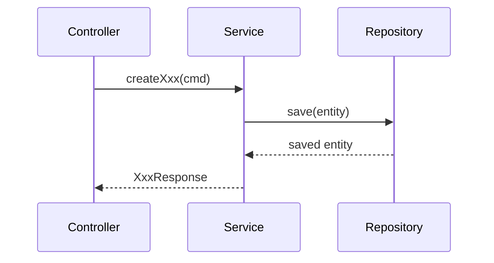

# Skill: solution-design — 方案设计

## 触发条件

当 `PRD_RECTIFIED.md` 状态为 `已冻结`，且需要输出或更新架构、接口、数据模型时使用。

## 输入

1. `docs/01-requirements/PRD_RECTIFIED.md`
2. `docs/01-requirements/MVP_SCOPE.md`（如有）
3. 相关变更文档（迭代场景）
4. `docs/01-requirements/PRD_RECTIFIED_GATE_REPORT.md`（冻结门禁报告，强制）
5. `openspec/project.md`（如项目启用 OpenSpec，则作为项目元信息与变更上下文补充输入）
6. `docs/01-requirements/product-spec.md`（如有，作为精简规格参考）
7. `docs/01-requirements/feature_list.json`（如有，作为结构化功能清单参考）
8. `docs/01-requirements/openapi.yaml`（如有，作为 OpenAPI 草稿起点；细化时必须保留已有字段约束，不得丢弃）

## 输出

1. `docs/03-architecture/ARCHITECTURE.md`
2. `docs/03-architecture/API_CONTRACT.md`
3. `docs/03-architecture/DATA_MODEL.md`
4. `docs/01-requirements/PRD_SOLUTION_PRECHECK_REPORT.md`（由 `scripts/run_prd_gate.sh --mode solution-precheck` 自动生成）

## 执行层级导读（Progressive Disclosure）

- `P0 必检（阻塞）`：需求基线冻结、设计边界不越权、三份设计文档可落地。
- `P1 扩展（覆盖）`：事务/幂等/并发、非功能量化、追溯矩阵与架构图一致性。
- `P2 参考（说明）`：模板与说明文本仅作参考，不参与放行。
- 执行顺序必须为：先过 `P0 Gate`，再进入 `P1`；`P2` 不得覆盖 `P0` 结论。

## 规则

1. 仅在 `PRD_RECTIFIED.md` 为 `已冻结` 时执行，非冻结必须回退 `prd-rectify`。
2. 在设计开始前，必须执行冻结补偿检查：
   - `scripts/run_prd_gate.sh --mode solution-precheck --repo-root "$PWD"`
   - 该检查会自动生成 `PRD_SOLUTION_PRECHECK_REPORT.md`
   - 若冻结状态、冻结门禁报告或 precheck 报告不满足，结论必须为 `BLOCKED` 并回退 `prd-rectify`。
3. 设计结论不得超出需求基线和范围边界。
4. 外部接口与内部接口必须分层，路径域必须分离（`/api/v1/**` 与 `/internal/v1/**`）。
5. `API_CONTRACT.md` 每个接口必须达到可实现粒度：
   - 接口所属功能中文名称（与 PRD 功能点一致）
   - 请求参数与返回字段
   - 每个请求字段必须标注位置：`body` 或 `uri`
   - 参数级约束（长度、范围、精度、格式、枚举、空值策略）
   - 至少 1 组成功示例与 1 组失败示例
   - 兼容策略（新增字段、废弃字段、版本影响）
6. `DATA_MODEL.md` 每张表必须达到可落地粒度：
   - 主键、唯一约束、非空约束、默认值
   - 关联关系（外键或逻辑关联）
   - 索引定义与索引用途说明（对应查询场景）
   - 可执行建表 SQL 与索引 SQL
   - 所有字段必须带中文 `COMMENT` 注释（禁止缺失注释或英文占位注释）
7. 关键状态变更流程必须给出实现边界：
   - 事务边界（同事务与最终一致性的划分）
   - 幂等策略（幂等键来源、重复请求处理）
   - 并发策略（冲突检测、锁或版本控制、失败处理）
8. 必须输出非功能量化基线：
   - 性能目标（响应时间、吞吐等）
   - 审计要求（关键操作审计字段与保留要求）
   - 可观测性要求（日志最小字段与告警触发条件）
9. 必须输出 `F -> API -> T -> TC` 追溯矩阵（以 `API_CONTRACT.md` 第 9 节为主，`ARCHITECTURE.md` 第 10 节标注引用，不得重复维护两份独立矩阵）；`TC` 可先占位，后续由 `qa-design` 补全。
10. `ARCHITECTURE.md` 必须包含以下架构图，且与正文一致：
   - 系统上下文图（System Context）
   - 组件架构图（Component）
   - 部署架构图（Deployment）
11. 架构图可使用 Mermaid、PlantUML 或等价文本图表达；不得仅写“见附件”而无正文图示。
12. 冷启动规则（强制）：
   - 若目标目录不存在，先创建目录。
   - 若目标文件不存在，按本 Skill 的最小结构创建完整文档。
   - 若目标文件状态为 `模板`，整文件覆盖为正式产物结构。
   - 若目标文件状态不为 `模板`，按章节标题增量更新，不按章节序号硬编码。
13. 规则去重：
   - `规则` 为主定义，`执行流程` 与后续检查仅引用编号与结论，不重复整段规则文本。
14. `API_CONTRACT.md` 必须在第 1 节输出"全局约定"，包含：
   - Base URL 定义（外部接口路径前缀 + 内部接口路径前缀）
   - 统一返回体结构（code / message / data / timestamp 字段定义）
   - HTTP 状态码映射表（200/400/401/403/404/409/422/500 各对应触发场景）
   - 认证方式（Bearer Token / Cookie Session，含 Header 名称或 Cookie 键名）
   - 分页规范（参数名称、pageNo 起始值、pageSize 取值范围与默认值、排序字段格式）
   - 时间格式约定（ISO-8601 或 Unix 毫秒时间戳，全局统一选一）
15. `DATA_MODEL.md` 必须在第 1 节输出"全局约定"，包含：
   - 公共字段规范（id / created_by / created_at / updated_by / updated_at，含类型与用途）
   - 软删除策略（`is_deleted + deleted_at` 方案 或 status 枚举含已删除态，二选一且全项目统一）
   - 乐观锁策略（version 字段使用规范，或声明不使用）
   - 命名规范（小写下划线、`t_` 表前缀、`idx_`/`uk_` 索引前缀）
   - 字符集与排序规则（utf8mb4 / utf8mb4_unicode_ci 或项目实际选型）
16. `ARCHITECTURE.md` 必须输出"核心业务流程序列图"，覆盖所有关键写操作（新增/更新/状态变更/删除）；每张序列图必须展示 Controller → Service → Domain/Repository 的完整调用链；使用 Mermaid `sequenceDiagram` 或 PlantUML 表达，不得仅用文字描述。
17. `ARCHITECTURE.md` 必须输出"安全与鉴权设计"，包含：
   - 认证方式与 Token 结构（JWT payload 字段定义 / Session 结构）
   - Token 有效期与刷新策略
   - 接口权限矩阵（角色 → 接口编号 → 路径 → 方法 → 允许/拒绝）
18. 构建工具基线必须根据项目技术栈判断（Maven 或 Gradle），不得在未确认技术栈时强制写入 Maven 配置；服务命名与模块划分原则保持不变。

## 执行流程

### 步骤 0：校验需求基线

- `PRD_RECTIFIED.md` 必须是 `已冻结`。
- 必须执行规则 2 定义的冻结补偿检查。
- 非冻结状态或 precheck 未通过时终止并返回 `prd-rectify`。

### 步骤 0.5：P0 Gate（阻塞）

- 校验三份目标文档输出路径可用。
- 校验范围边界与需求编号可追溯。
- 校验输入 `PRD_RECTIFIED_GATE_REPORT.md` 对应机器结果已通过（`verdict=PASS`）。
- 校验规则 2 自动生成的 `PRD_SOLUTION_PRECHECK_REPORT.md` 对应机器结果已通过（`verdict=PASS`）。
- 任一不满足时输出 `BLOCKED/FAIL` 并停止，不进入后续步骤。

### 步骤 1：初始化输出载体（冷启动）

- 确保 `docs/03-architecture/` 存在。
- 初始化 3 份输出文件（若缺失则创建；若为模板则覆盖）。

`ARCHITECTURE.md` 最小结构：

```markdown
# 架构设计

## 文档信息
- 文档类型：产物
- 生成 Skill：`solution-design`
- 上游输入：`PRD_RECTIFIED.md`
- 版本：v1.0
- 日期：YYYY-MM-DD
- 状态：草稿 / 已整改 / 已冻结

## 目标

## 范围

## 1. 系统形态与模块划分

## 2. 服务拓扑与调用关系

## 3. 接口分层策略（外部/内部）

## 4. 关键流程实现边界（事务/幂等/并发）

## 5. 公共能力与错误码体系

## 6. 非功能量化基线（性能/审计/可观测）

## 7. 系统上下文图（System Context）

## 8. 组件架构图（Component）

## 9. 部署架构图（Deployment）

## 10. 追溯矩阵（F->API->T->TC）

> 本节为引用指向，主矩阵见 `API_CONTRACT.md` 第 9 节；此处仅标注版本与变更日期，不得另行维护独立矩阵。

## 11. 核心业务流程序列图

<!-- 每个关键写操作（新增/更新/状态变更/删除）一张序列图，使用 Mermaid sequenceDiagram -->
<!-- 示例：

-->

## 12. 安全与鉴权设计

### 12.1 认证方式

### 12.2 Token 结构与有效期

### 12.3 接口权限矩阵

| 角色 | 接口编号 | 路径 | 方法 | 允许/拒绝 |
|---|---|---|---|---|

## 异常与边界

## 完成检查

## 变更记录
```

`API_CONTRACT.md` 最小结构：

```markdown
# 接口契约

## 文档信息
- 文档类型：产物
- 生成 Skill：`solution-design`
- 上游输入：`PRD_RECTIFIED.md`、`ARCHITECTURE.md`
- 版本：v1.0
- 日期：YYYY-MM-DD
- 状态：草稿 / 已整改 / 已冻结

## 目标

## 范围

## 1. 全局约定

### 1.1 Base URL
- 外部接口：`/api/v1`
- 内部接口：`/internal/v1`

### 1.2 统一返回体
```json
{
  "code": "string",       // 业务状态码，SUCCESS 或错误码键
  "message": "string",    // 提示文案（面向用户）
  "data": "object|null",  // 业务数据体
  "timestamp": "number"   // Unix 毫秒时间戳
}
```

### 1.3 HTTP 状态码映射
| HTTP 状态码 | 含义 | 触发场景 |
|---|---|---|
| 200 | 成功 | 所有成功请求 |
| 400 | 参数错误 | 格式或约束不满足 |
| 401 | 未认证 | Token 缺失或过期 |
| 403 | 无权限 | 角色不满足接口权限 |
| 404 | 资源不存在 | 目标记录不存在 |
| 409 | 冲突 | 幂等重复提交或唯一约束冲突 |
| 422 | 业务规则违反 | 参数合法但业务校验失败 |
| 500 | 服务器内部错误 | 未预期异常 |

### 1.4 认证方式
- `Authorization: Bearer <token>`（或项目实际选型，需明确写明 Header 名称）

### 1.5 分页规范
- 请求参数：`pageNo`（从 1 开始）、`pageSize`（范围：1-100，默认 20）
- 排序参数：`sortField`（字段名）、`sortOrder`（ASC / DESC）
- 返回结构：`{ list: [], total: number, pageNo: number, pageSize: number }`

### 1.6 时间格式
- 全局统一选一：ISO-8601（`YYYY-MM-DDTHH:mm:ssZ`）或 Unix 毫秒时间戳；不得混用

## 2. 接口域定义
- 外部接口：`/api/v1/**`
- 内部接口：`/internal/v1/**`

## 3. 接口清单
| 接口编号 | 接口名称 | 所属功能（中文） | 路径 | 方法 | 调用方 | 关联需求 |
|---|---|---|---|---|---|---|

## 4. 接口明细（含参数级约束）

## 5. 请求与响应示例（成功/失败）

## 6. 错误码映射（错误码/错误键/触发条件/提示口径）

## 7. 接口兼容与版本策略

## 8. 写操作边界（事务/幂等/并发）

## 9. 追溯矩阵（F->API->T->TC）

## 异常与边界

## 完成检查

## 变更记录
```

`DATA_MODEL.md` 最小结构：

```markdown
# 数据模型设计

## 文档信息
- 文档类型：产物
- 生成 Skill：`solution-design`
- 上游输入：`PRD_RECTIFIED.md`、`ARCHITECTURE.md`、`API_CONTRACT.md`
- 版本：v1.0
- 日期：YYYY-MM-DD
- 状态：草稿 / 已整改 / 已冻结

## 目标

## 范围

## 1. 全局约定

### 1.1 公共字段规范
| 字段名 | 类型 | 说明 |
|---|---|---|
| id | BIGINT UNSIGNED AUTO_INCREMENT | 主键，自增 |
| created_by | VARCHAR(64) NOT NULL | 创建人账号 |
| created_at | DATETIME NOT NULL DEFAULT CURRENT_TIMESTAMP | 创建时间 |
| updated_by | VARCHAR(64) NOT NULL | 最后更新人账号 |
| updated_at | DATETIME NOT NULL DEFAULT CURRENT_TIMESTAMP ON UPDATE CURRENT_TIMESTAMP | 最后更新时间 |

### 1.2 软删除策略
（以下二选一，全项目统一，明确写明所选方案）
- 方案 A：`is_deleted TINYINT(1) NOT NULL DEFAULT 0 COMMENT '是否删除：0-否 1-是'` + `deleted_at DATETIME COMMENT '删除时间'`
- 方案 B：status 枚举字段内含已删除态（需在枚举定义中明确标注）

### 1.3 乐观锁策略
- 使用：`version BIGINT NOT NULL DEFAULT 0 COMMENT '乐观锁版本号'`
- 或明确声明：本项目不使用乐观锁，并说明并发控制替代方案

### 1.4 命名规范
- 表名：小写下划线，`t_` 前缀
- 字段名：小写下划线
- 普通索引：`idx_表名_字段名`
- 唯一索引：`uk_表名_字段名`
- 字符集：utf8mb4，排序规则：utf8mb4_unicode_ci

## 2. 数据域与模块归属

## 3. 表结构清单
| 表编号 | 表名 | 归属模块 | 关联需求 |
|---|---|---|---|

## 4. 表结构明细（主键/唯一/非空/默认值/关联关系）

## 5. 字段映射（接口字段->表字段->约束）

## 6. 建表 SQL

## 7. 索引 SQL 与索引用途说明

## 异常与边界

## 完成检查

## 变更记录
```

### 步骤 2：识别系统形态（条件强制）

从需求和范围文档判断：

- 单端：后台管理端
- 多端：后台管理端 + 移动端或小程序端

根据结果在设计中强制落地：

- 服务命名必须与 `ARCHITECTURE.md` 保持一致。
- 单端默认示例：`admin-service`
- 多端默认示例：`admin-service + app-service`

### 步骤 3：输出 `ARCHITECTURE.md`

架构文档必须覆盖：

1. 构建工具基线（Maven 或 Gradle，按项目技术栈确定）：父模块 + common + 业务服务（规则 18）。
2. 父模块职责：仅版本管理。
3. 公共模块职责：统一返回体、错误键、通用异常。
4. 服务拓扑与调用关系。
5. 外部接口与内部接口分层策略。
6. 关键流程实现边界（事务、幂等、并发）。
7. 错误码国际化目录与文件规范（`resources/error/`）。
8. 非功能量化基线（性能、审计、可观测）。
9. 系统上下文图（System Context）。
10. 组件架构图（Component）。
11. 部署架构图（Deployment）。
12. 引用 `API_CONTRACT.md` 第 9 节的追溯矩阵（`F -> API -> T -> TC`），在 `ARCHITECTURE.md` 第 10 节标注引用说明（规则 9）。
13. 核心业务流程序列图：覆盖所有关键写操作，展示 Controller → Service → Domain/Repository 完整调用链（规则 16）。
14. 安全与鉴权设计：认证方式、Token 结构与有效期、接口权限矩阵（规则 17）。

### 步骤 4：输出 `API_CONTRACT.md`

每个接口必须明确：

- 第 1 节输出全局约定（统一返回体、HTTP 状态码映射、认证方式、分页规范、时间格式）（规则 14）。
- 接口编号、所属功能中文名称、关联需求、调用方、鉴权方式。
- 请求参数和返回字段。
- 每个请求字段的位置必须明确标注为 `body` 或 `uri`。
- 参数级约束（长度、范围、精度、格式、枚举、空值策略）。
- 请求和响应示例（至少成功与失败各 1 组）。
- 错误码映射（错误码、错误键、触发条件、提示口径）。
- 兼容策略（字段新增、字段废弃、版本影响）。
- 写操作边界（事务、幂等、并发）。

### 步骤 5：输出 `DATA_MODEL.md`

数据模型文档必须覆盖：

- 第 1 节输出全局约定（公共字段规范、软删除策略、乐观锁策略、命名规范、字符集）（规则 15）。
- 表结构与需求、接口字段一致性。
- 每张表关联服务模块。
- 主键、唯一、非空、默认值、关联关系。
- 字段映射（接口字段 -> 表字段 -> 约束）。
- 每张表的建表 SQL。
- 每张表的索引 SQL 与索引用途说明。
- 每张表 SQL 的每个字段必须包含中文 `COMMENT` 注释；缺失则视为不通过。

### 步骤 6：输出追溯矩阵

- `F -> API -> T -> TC` 追溯矩阵以 `API_CONTRACT.md` 为主（第 9 节），`ARCHITECTURE.md`（第 10 节）引用指向前者，不得重复维护两份独立矩阵。
- `TC` 未分配时可写占位值（如 `TC-TBD`），并标记后续由 `qa-design` 补齐。

### 步骤 7：交叉校验

- [ ] 模块拆分与项目形态一致。
- [ ] 接口路径区分外部与内部。
- [ ] 每个接口已包含参数级约束、示例、错误码映射和兼容策略。
- [ ] 接口清单与接口明细均已填写”所属功能（中文）”。
- [ ] 每个请求字段均标注位置为 `body` 或 `uri`（无缺失）。
- [ ] 关键写操作已定义事务、幂等与并发边界。
- [ ] 非功能指标已量化，且具备验证口径。
- [ ] `ARCHITECTURE.md` 已输出系统上下文图、组件架构图、部署架构图，且与正文一致。
- [ ] `DATA_MODEL.md` 每张表均有约束说明、建表 SQL 与索引 SQL。
- [ ] 所有建表 SQL 字段均包含中文 `COMMENT` 注释（无缺失、无英文占位）。
- [ ] `F -> API -> T -> TC` 追溯矩阵已在 `API_CONTRACT.md` 第 9 节输出，`ARCHITECTURE.md` 第 10 节标注引用。
- [ ] 接口、数据表、需求编号可追溯。
- [ ] `API_CONTRACT.md` 已输出全局约定（统一返回体、HTTP 状态码映射、认证方式、分页规范、时间格式）（规则 14）。
- [ ] `DATA_MODEL.md` 已输出全局约定（公共字段规范、软删除策略、乐观锁策略、命名规范）（规则 15）。
- [ ] `ARCHITECTURE.md` 已输出核心业务流程序列图，覆盖所有关键写操作（规则 16）。
- [ ] `ARCHITECTURE.md` 已输出安全与鉴权设计，包含接口权限矩阵（规则 17）。
- [ ] 构建工具基线已根据项目技术栈确定，未硬编码构建工具（规则 18）。

### 步骤 8：提示下一步

- 下一步使用 `architecture-review` 对设计基线执行结构化评审。
- 若评审存在问题，进入 `architecture-rectify` 关闭问题并完成设计冻结。
- 设计基线完成冻结后，方可进入 `qa-design`。

## Quality Gate（分层）

### P0 Gate（阻塞，最小必检）

- [ ] `PRD_RECTIFIED.md` 为 `已冻结`。
- [ ] `scripts/run_prd_gate.sh --mode solution-precheck` 已执行通过，且 `PRD_SOLUTION_PRECHECK_REPORT.md` 结论为通过。
- [ ] `ARCHITECTURE.md`、`API_CONTRACT.md`、`DATA_MODEL.md` 均已输出且结构可判定。
- [ ] 任一关键设计约束缺失（接口粒度、表结构约束、SQL、追溯矩阵）时结论必须为 `FAIL/BLOCKED`。

### P1 Coverage Checklist（扩展覆盖）

- [ ] 架构图（System Context/Component/Deployment）与正文一致。
- [ ] 写操作事务/幂等/并发边界完整。
- [ ] 非功能量化基线与可观测性要求完整。
- [ ] `F -> API -> T -> TC` 追溯矩阵完整。
- [ ] `API_CONTRACT.md` 全局约定（统一返回体、HTTP 状态码映射、分页规范）完整（规则 14）。
- [ ] `DATA_MODEL.md` 全局约定（公共字段、软删除策略、乐观锁策略）完整（规则 15）。
- [ ] `ARCHITECTURE.md` 核心业务流程序列图覆盖所有关键写操作（规则 16）。
- [ ] `ARCHITECTURE.md` 接口权限矩阵与 PRD 角色定义一致（规则 17）。

### P2 Reference Checklist（参考）

- [ ] 模板与说明文本已更新，且不改变 `P0` 判定口径。

## 注意事项

- 不得在本阶段实现代码。
- 不得新增 PRD 未定义的业务能力。
- 增量场景应局部更新，保留历史基线可追溯性。
- `openspec/project.md` 仅在项目启用 OpenSpec 时读取；未启用时忽略，不构成阻塞。
- 本 Skill 负责产出设计草案或更新设计版本；设计问题关闭与冻结由 `architecture-rectify` 负责。
